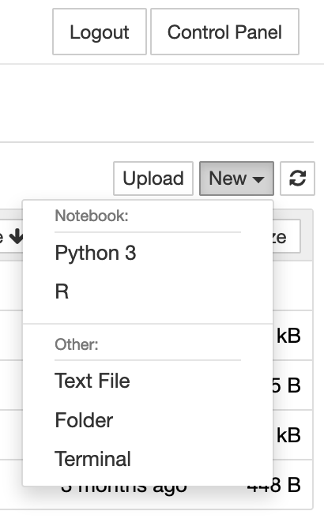

# NLTK

## Overview

NLTK is a set of tools that, similar to Voyant, let you quickly accomplish some of the core tasks in text mining, preparation, and analysis. It is free and open source and a component of Python. The core benefits of using a tool like NLTK is the high level of flexibility with how you interact with the corpus of text that you are analyzing. While the learning curve is higher, NLTK has many openly available tutorials for beginners. Learning Python, the language NLTK is working within, is also an easily transferrable skill.

For this section of the workshop we will be working in UBC Syszgy.

1. Please log in to [UBC Syzygy here](https://ubc.syzygy.ca/). Click on the red house and log in via UBC CWL.

2. In the upper right hand side of the page select "New" and then "Python 3" from the dropdown.

